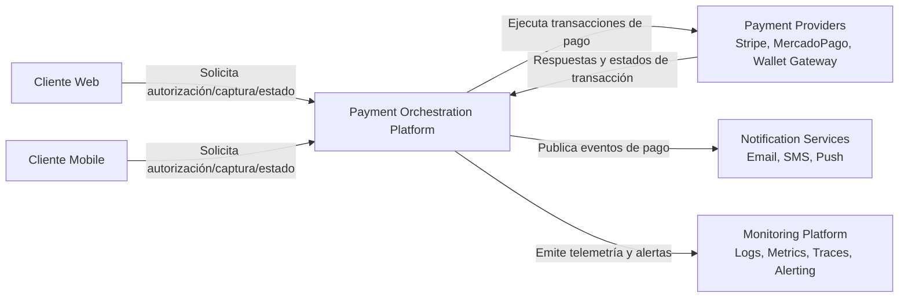

# C4 - Nivel 1 - System Context

# Objetivo
Definir el perímetro de la Payment Orchestration Platform y su interacción con actores y sistemas externos críticos en un contexto fintech transaccional.

# Alcance
Esta vista muestra relaciones de alto nivel entre clientes, plataforma de orquestación, proveedores de pago, servicios de notificación y plataforma de monitoreo.

No describe detalle interno de clases o implementación.

# Componentes
- Cliente Web
- Cliente Mobile
- Payment Orchestration Platform
- Payment Providers
- Notification Services
- Monitoring Platform

# Responsabilidades
- Cliente Web/Mobile: iniciar operaciones de pago y consultar estado.
- Payment Orchestration Platform: aplicar reglas de dominio, idempotencia, enrutamiento y trazabilidad.
- Payment Providers: procesar autorizaciones/capturas/rechazos.
- Notification Services: informar eventos de negocio a usuarios o sistemas.
- Monitoring Platform: detección temprana de degradación, incidentes y anomalías.

# Riesgos
- Dependencia operacional de terceros (providers) con SLA heterogéneo.
- Timeouts o respuestas ambiguas en escenarios de alta concurrencia.
- Riesgo reputacional y financiero por duplicidad de cobros.
- Riesgo de propagación de fallas si no hay aislamiento ni fallback.

# Escalabilidad
- Escalado horizontal de la plataforma para picos de tráfico.
- Estrategia multi-provider para distribuir carga y reducir vendor lock-in.
- Uso de flujos asíncronos para notificaciones y procesos no críticos al usuario.

# Seguridad
- Autenticación fuerte en el edge de API.
- Autorización por alcance/rol para operaciones sensibles.
- Cifrado en tránsito (TLS) y controles de secretos para integraciones externas.
- Auditoría de eventos transaccionales con correlación end-to-end.

# Observabilidad
- Correlation ID por operación de pago.
- Métricas de éxito/fallo por provider.
- Trazas distribuidas entre edge, orquestador y adapters.
- Alertas por burn rate de SLO, latencia y errores de proveedor.

# Métricas Objetivo
- Availability Target: >= 99.95% mensual.
- Latency Target: p95 <= 300 ms en API de autorización (sin incluir latencia extrema externa).
- Error Rate Target: <= 0.20% en operaciones de pago iniciadas.
- Recovery Target: MTTR <= 30 minutos para incidentes Sev-1.

# Decisiones Arquitectónicas Relacionadas
- [ADR-001 Hexagonal Architecture](../adrs/ADR-001-hexagonal-architecture.md)
- [ADR-002 Payment Provider Adapters](../adrs/ADR-002-payment-provider-adapters.md)
- [ADR-003 Idempotency Strategy](../adrs/ADR-003-idempotency-strategy.md)

# Cómo defenderlo en una entrevista
Qué decir:
- Esta vista demuestra que primero definimos límites de sistema y dependencias críticas para reducir riesgo de diseño en pagos.
- En plataformas transaccionales, el contexto correcto evita acoplamientos prematuros y mejora la resiliencia.

Preguntas frecuentes:
- Por qué separar explícitamente providers y notificaciones.
- Cómo se evita que una caída de provider tumbe toda la plataforma.
- Qué métricas validan que la arquitectura funciona.

Respuestas sugeridas:
- Providers y notificaciones tienen perfiles de criticidad distintos; separarlos permite estrategias de resiliencia diferenciadas.
- Se usan timeouts, retries acotados, idempotencia y enrutamiento multi-provider para contener fallas.
- Validamos con SLO de disponibilidad, latencia p95, tasa de error y MTTR.
