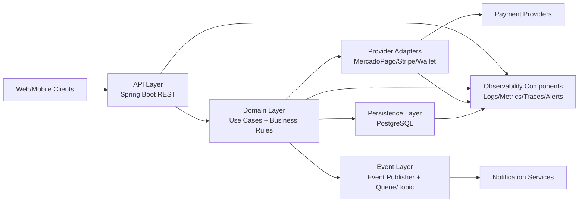

# C4 - Nivel 2 - Container Diagram

# Objetivo
Describir los contenedores principales de la Payment Orchestration Platform y sus relaciones para soportar transacciones de pago con confiabilidad y extensibilidad.

# Alcance
Incluye capas lógicas desplegables y dependencias de datos/eventos/telemetría dentro del sistema.

No entra en detalle de clases internas.

# Componentes
- API Layer
- Domain Layer
- Provider Adapters
- Persistence Layer
- Event Layer
- Observability Components

# Responsabilidades
- API Layer: exposición de contratos HTTP, validación de entrada y trazabilidad de requests.
- Domain Layer: orquestación de casos de uso, reglas de negocio, idempotencia y políticas de enrutamiento.
- Provider Adapters: traducción de modelo canónico a APIs externas y normalización de respuestas/errores.
- Persistence Layer: persistencia transaccional, estado de pago e información idempotente.
- Event Layer: publicación de eventos de dominio para integraciones downstream.
- Observability Components: visibilidad operativa para soporte de SLO e incident response.

# Riesgos
- Cuellos de botella en persistencia bajo alta concurrencia.
- Inestabilidad por variabilidad de latencia de proveedores externos.
- Riesgo de acoplamiento accidental si la lógica de negocio migra a adaptadores.
- Riesgo de inconsistencia si eventos y estado transaccional no se coordinan correctamente.

# Escalabilidad
- API y Domain con escalado horizontal stateless.
- Particionado lógico por tipo de operación y provider routing.
- Desacople de cargas no críticas vía Event Layer.
- Índices y tuning de persistencia para evitar degradación de p95.

# Seguridad
- Protección de endpoints con autenticación/autorización basada en scopes.
- Encriptación de datos sensibles en tránsito y en reposo.
- Gestión de secretos para credenciales de proveedores.
- Validación estricta de payload y control de abuso (rate limiting).

# Observabilidad
- Dashboards por capa: API, dominio, providers y persistencia.
- Métricas de latencia por endpoint y por provider.
- Trazas distribuidas por operación con correlation ID.
- Alertas por error rate, saturación de DB, colas y burn rate de SLO.

# Métricas Objetivo
- Availability Target: >= 99.95% mensual.
- Latency Target: p95 <= 300 ms en API (p95 interno sin dependencia externa <= 120 ms).
- Error Rate Target: <= 0.20% global y <= 0.35% por provider.
- Recovery Target: MTTR <= 30 minutos, RTO <= 60 minutos.

# Decisiones Arquitectónicas Relacionadas
- [ADR-001 Hexagonal Architecture](../adrs/ADR-001-hexagonal-architecture.md)
- [ADR-002 Payment Provider Adapters](../adrs/ADR-002-payment-provider-adapters.md)
- [ADR-003 Idempotency Strategy](../adrs/ADR-003-idempotency-strategy.md)

# Cómo defenderlo en una entrevista
Qué decir:
- Esta vista traduce decisiones arquitectónicas en contenedores operables, mostrando claramente límites, responsabilidades y puntos de falla.
- Es clave para alinear equipos de backend, plataforma y operaciones.

Preguntas frecuentes:
- Por qué separar Domain Layer de Provider Adapters.
- Dónde se implementa idempotencia y por qué.
- Cómo se evita que eventos rompan consistencia.

Respuestas sugeridas:
- La separación evita contaminar reglas de negocio con detalles externos, facilitando reemplazo de proveedores.
- Idempotencia reside en dominio y persistencia para garantizar consistencia transaccional.
- Se coordina estado persistido y publicación de eventos con patrones de consistencia transaccional y observabilidad.
