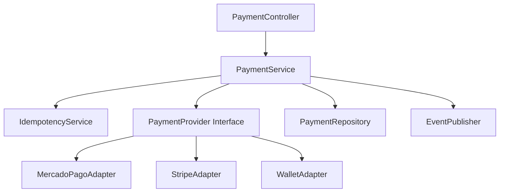

# C4 - Nivel 3 - Component Diagram

# Objetivo
Detallar los componentes internos del contenedor de aplicación para demostrar cómo se implementan las decisiones de hexagonal, adapters de pago e idempotencia.

# Alcance
Describe los componentes del servicio de orquestación y sus dependencias lógicas internas.

No incluye aún implementación Java ni detalle de infraestructura.

# Componentes
- PaymentController
- PaymentService
- PaymentProvider Interface
- MercadoPagoAdapter
- StripeAdapter
- WalletAdapter
- IdempotencyService
- PaymentRepository
- EventPublisher

# Responsabilidades
- PaymentController: recibe requests, valida formato y delega al caso de uso.
- PaymentService: orquesta flujo transaccional, reglas de negocio y decisiones de enrutamiento.
- PaymentProvider Interface: contrato único de integración para proveedores externos.
- MercadoPagoAdapter/StripeAdapter/WalletAdapter: traducción de modelo canónico, manejo de errores y timeouts por proveedor.
- IdempotencyService: evita doble ejecución de la misma intención de pago.
- PaymentRepository: persistencia de pagos, estados y claves idempotentes.
- EventPublisher: emisión de eventos de dominio para procesos downstream.

# Riesgos
- Sobrecarga del PaymentService si acumula demasiadas responsabilidades.
- Riesgo de divergencia semántica entre adapters y contrato canónico.
- Contención en repositorio idempotente bajo picos de tráfico.
- Riesgo de duplicidad de eventos si no hay control de publicación.

# Escalabilidad
- Servicio stateless para escalado horizontal.
- Separación clara de componentes para paralelizar evolución por equipo.
- Optimización de repositorio idempotente con índices y políticas de retención.
- Posibilidad de sumar nuevos adapters sin modificar el núcleo.

# Seguridad
- Validación estricta de payload de entrada y contratos de salida.
- Sanitización de datos sensibles en logs de adapters.
- Control de secretos por proveedor y rotación periódica.
- Protección de endpoints críticos con scopes y auditoría.

# Observabilidad
- Trazas por componente del flujo de pago.
- Métricas por adapter: latencia, tasa de error y timeout rate.
- Métricas de idempotencia: hit rate, conflict rate, duplicate prevention count.
- Eventos de negocio y técnicos con correlation ID.

# Métricas Objetivo
- Availability Target: >= 99.95% mensual del servicio.
- Latency Target: p95 <= 300 ms en authorize; p95 <= 150 ms en consultas de estado.
- Error Rate Target: <= 0.20% global; timeout rate por adapter <= 0.50%.
- Recovery Target: MTTR <= 30 minutos; recuperación funcional de provider fallback <= 10 minutos.

# Decisiones Arquitectónicas Relacionadas
- [ADR-001 Hexagonal Architecture](../adrs/ADR-001-hexagonal-architecture.md)
- [ADR-002 Payment Provider Adapters](../adrs/ADR-002-payment-provider-adapters.md)
- [ADR-003 Idempotency Strategy](../adrs/ADR-003-idempotency-strategy.md)

# Cómo defenderlo en una entrevista
Qué decir:
- Este componente traduce decisiones de arquitectura en responsabilidades concretas y desacopladas, preparadas para evolución sin comprometer el dominio.
- La combinación de interface + adapters + idempotencia reduce riesgo técnico y financiero en pagos.

Preguntas frecuentes:
- Por qué PaymentService centraliza la orquestación.
- Cómo se agrega un nuevo provider sin romper lo existente.
- Dónde se controla la doble ejecución.

Respuestas sugeridas:
- PaymentService centraliza reglas y flujo para mantener consistencia del dominio; la complejidad externa se delega a adapters.
- Se implementa un nuevo adapter del contrato PaymentProvider y se incorpora por configuración/política de enrutamiento.
- IdempotencyService y repositorio validan clave y payload para devolver respuesta determinista.
